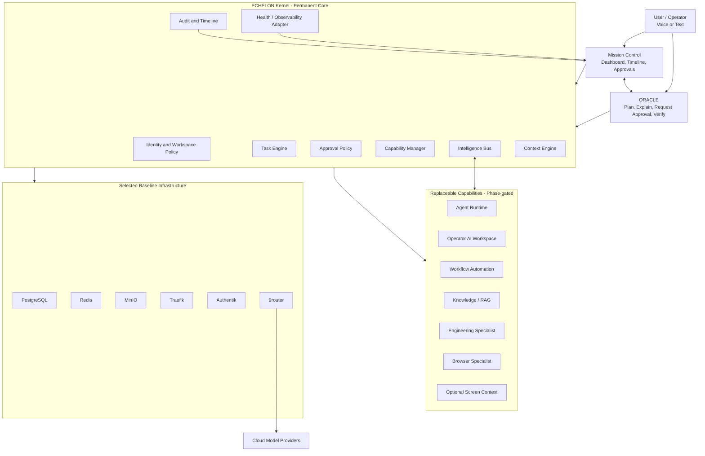
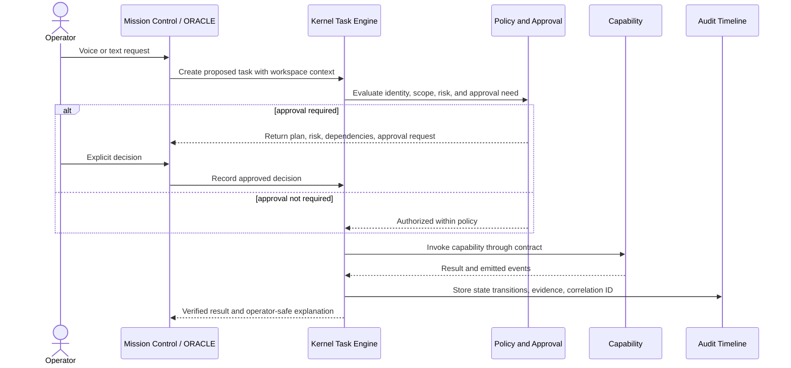
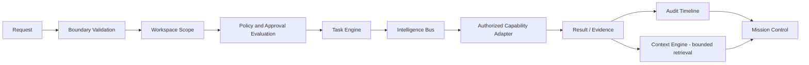

# ECHELON System Architecture Overview

## Status

This is the approved target architecture for the current v0.3 baseline. It is not a statement that all components are deployed. ECHELON remains in Phase -1.

## 1. Architectural style

ECHELON is designed as a **kernel-and-capability platform**:

- The **Kernel** is permanent and owns identity boundaries, task lifecycle, approvals, audit, capability registration, event contracts, and policy enforcement.
- **Mission Control** is the operator-facing visual console.
- **ORACLE** is the built-in voice/text assistant that creates explainable plans, requests approval, invokes authorized tasks, verifies results, and records the timeline.
- **Capabilities** are replaceable adapters or services. They cannot couple directly to one another; they integrate through Kernel contracts and the Intelligence Bus.
- **Workspaces** scope identity, knowledge, secrets, memory, capabilities, data, and authorization.

## 2. High-level component diagram

## 3. Operator request and approval flow

## 4. Data and event flow

## 5. Design decisions and rationale

| Decision                                          | Rationale                                                                                                              |
| ------------------------------------------------- | ---------------------------------------------------------------------------------------------------------------------- |
| Kernel is permanent; capabilities are replaceable | Prevents third-party tool choice from becoming platform architecture.                                                  |
| Event-driven integration                          | Reduces direct coupling and improves observability.                                                                    |
| Human approval for critical actions               | Prevents autonomous changes to secrets, access, spending, external communication, deletion, or other high-impact work. |
| GitHub is source of truth                         | Keeps architecture, code, review, and evidence in a versioned system.                                                  |
| OrbStack Docker on Apple Silicon                  | Provides one documented local container runtime and arm64 target.                                                      |
| Cloud LLMs are default                            | Matches the M1 16 GB resource constraint.                                                                              |
| Workspace-scoped context                          | Limits data leakage and unwanted cross-agent memory.                                                                   |
| Screen and voice context are optional             | Requires consent, visibility, data classification, retention, and deletion controls.                                   |

## 6. Scalability model

### Local development

Run only the `core` and `platform` profiles by default. Keep cloud model inference external. Run a single heavy candidate capability at a time.

### Linux staging

Use Linux staging for multi-service, load, backup/restore, resilience, and failure-injection tests.

### Production direction

Scale services independently:

- Kernel API and workers scale from event/task load.
- PostgreSQL, Redis, and MinIO scale according to state, queue, and object usage.
- Capability services scale only when adopted and measured.
- Observability is separated from the core request path.

## 7. Constraints and limitations

- No executable implementation exists yet.
- No stable API, event schema, database schema, or service deployment exists.
- Candidate tools are not approved for installation until their evaluation, module record, security/license review, and phase gate are complete.
- GitHub security settings and physical host configuration require manual verification outside repository files.

## 8. Anti-patterns explicitly prohibited

- Direct capability-to-capability business coupling.
- External chat platforms acting as the authorization system.
- Unbounded shared memory across workspaces or agents.
- Continuous screen/microphone capture by default.
- Privileged containers, host networking, Docker socket mounts, or broad user-home mounts without documented exception.
- Combining unrelated databases, proxies, identity providers, and applications into one container to reduce image count.
