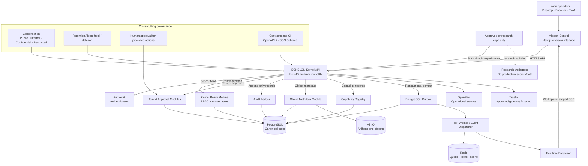

# ECHELON Phase 0 Wire Diagram

**Status:** Architecture reference  
**Scope:** Approved Phase 0 baseline

## Reading the diagram

- **Mission Control** renders state and submits commands. It is not an authority layer.
- **ECHELON Kernel** is authoritative for workspaces, policy, tasks, approvals, audit, capabilities, and governed references.
- **PostgreSQL** is canonical. **Redis** is transient coordination only.
- Business mutation, audit record, and event outbox are committed atomically.
- **SSE** provides safe, workspace-filtered UI updates; it is not the source of truth.
- **MinIO** holds object bytes; PostgreSQL holds the corresponding metadata and control records.
- **Authentik** authenticates; ECHELON authorizes. **OpenBao** is the operational secrets boundary.
- Capabilities are replaceable and receive short-lived, workspace-scoped identities.

## Phase 0 exclusions

Cloud LLM routing, full RAG, browser automation, autonomous external actions, voice, screen intelligence, and Foundry installation are not active in this wire diagram. They are later capabilities and remain subject to the Phase 0 controls shown above.
